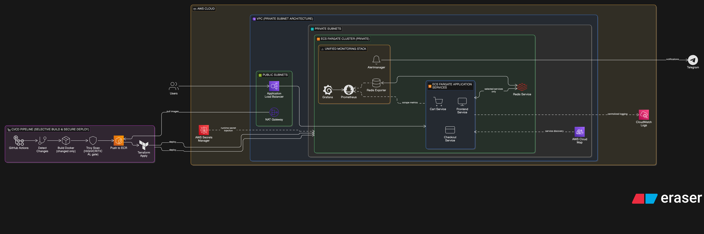

End-to-End Microservices Deployment on AWS using ECS Fargate, Terraform and GitHub Actions
Overview

This project demonstrates an end-to-end deployment of a microservices-based application on AWS using Infrastructure as Code, container security scanning, and a cloud-native monitoring stack.

The focus of this project is to showcase real-world DevOps practices such as private networking, service discovery, CI/CD automation, observability, and secure secret management using AWS-native services.

System Components

The system includes:

Multiple containerized microservices

AWS ECS Fargate for serverless container orchestration

Application Load Balancer with path-based routing

AWS Cloud Map for internal service discovery

Amazon ECR for container image registry

Terraform for infrastructure provisioning

GitHub Actions for CI/CD automation

Trivy for container vulnerability scanning

Prometheus for metrics collection

Alertmanager for alerting (Telegram integration)

Grafana for metrics visualization (stateless)

Architecture
High-Level Flow

GitHub Actions builds Docker images

Trivy scans images for HIGH and CRITICAL vulnerabilities

Clean images are pushed to Amazon ECR

Terraform provisions and updates AWS infrastructure

ECS Fargate runs microservices in private subnets

Public ALB serves frontend traffic

Private ALB serves monitoring components

AWS Cloud Map enables DNS-based service discovery

Prometheus scrapes metrics from ECS services

Alertmanager sends alerts to Telegram

Grafana visualizes metrics

Architecture Diagram

Tech Stack

AWS ECS Fargate

Amazon ECR

Application Load Balancer (Public & Private)

AWS Cloud Map

AWS Secrets Manager

Terraform

GitHub Actions

Docker

Trivy

Prometheus

Alertmanager

Grafana

CI/CD Pipeline Flow

On every push to the main branch:

GitHub Actions detects modified services

Only changed services are built

Docker images are built

Trivy scans images for HIGH and CRITICAL vulnerabilities

If scan passes, images are pushed to Amazon ECR

Terraform initializes and applies infrastructure changes

ECS services are updated with new image versions

Security Enforcement Rule
Build → Scan → Push → Deploy

If vulnerability scanning fails, deployment is blocked.

Infrastructure Design
Networking

ECS services run in private subnets

Application Load Balancer runs in public subnets

Monitoring stack uses a private ALB

No public IPs on ECS tasks

Bastion access is provided via AWS SSM Session Manager

No SSH access is enabled

Service Discovery

AWS Cloud Map provides private DNS-based discovery

Services communicate using internal DNS names

Prometheus dynamically discovers scrape targets via Cloud Map

Container Deployment

Each microservice runs as an independent ECS Fargate service

Autoscaling configured based on CPU utilization

Stateless service design for application containers

Monitoring services deployed separately from application services

Monitoring and Alerting
Prometheus

Scrapes metrics from ECS services

Tracks application and container-level metrics

Uses service discovery instead of static targets

Alertmanager

Receives alerts from Prometheus

Sends notifications to Telegram using webhook integration

Grafana

Connected to Prometheus as a data source

Used for visualizing service metrics

Deployed as a stateless ECS service

Persistent storage (EFS) intentionally not enabled in this version

Note: For production readiness, Grafana persistence should be implemented using Amazon EFS mounted at /var/lib/grafana.

Secrets Management

Sensitive values are securely stored in AWS Secrets Manager, including:

Telegram bot token

Grafana admin credentials

Secrets are injected into ECS tasks at runtime.
No credentials are hardcoded in the repository.

Deployment Instructions
Prerequisites

AWS account

IAM user with required permissions

Terraform installed

Docker installed

GitHub repository secrets configured:

AWS_ACCESS_KEY_ID

AWS_SECRET_ACCESS_KEY

Manual Deployment
git clone <repo-url>
cd terraform
terraform init
terraform plan
terraform apply
CI/CD Deployment

Push changes to the main branch.
GitHub Actions automatically builds, scans, pushes, and deploys services.

Project Structure
.
├── src/                    # Microservices source code
├── monitor/                # Prometheus & Alertmanager configs
├── terraform/              # Infrastructure as Code
├── .github/workflows/      # CI/CD pipelines
└── README.md
Security Controls

No hardcoded credentials

Secrets managed via AWS Secrets Manager

Vulnerability scanning before image push

ECS services in private subnets

Strict security group isolation

Infrastructure fully managed using Terraform

Future Improvements

Grafana persistence using Amazon EFS

HTTPS with ACM on ALBs

Blue/Green deployments

Canary releases

GitHub OIDC authentication

Automated Grafana dashboard provisioning

Recording rules in Prometheus

Author

Rohit Neel Mishra

Microservices infrastructure project demonstrating practical DevOps, cloud engineering, CI/CD automation, and observability implementation on AWS.