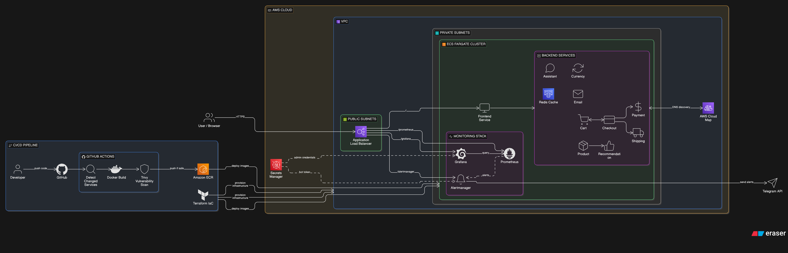

End-to-End Microservices Deployment on AWS using ECS Fargate, Terraform and GitHub Actions
Overview

This project demonstrates a production-style deployment of a microservices-based application on AWS using Infrastructure as Code and a secure CI/CD pipeline.

The system includes:

Multiple containerized microservices

AWS ECS Fargate for serverless container orchestration

Application Load Balancer with path-based routing

AWS Cloud Map for internal service discovery

Amazon ECR for container registry

Terraform for infrastructure provisioning

GitHub Actions for CI/CD automation

Trivy for container vulnerability scanning

Prometheus for metrics collection

Grafana for visualization

Alertmanager for alerting via Telegram

The pipeline ensures that only vulnerability-scanned images are deployed.

Architecture

High-level components:

GitHub Actions builds and scans Docker images

Safe images are pushed to Amazon ECR

Terraform provisions and updates AWS infrastructure

ECS Fargate runs services in private subnets

ALB routes traffic to frontend, Prometheus, Grafana, Alertmanager

Cloud Map enables internal service-to-service discovery

Prometheus scrapes metrics

Alertmanager sends alerts

Grafana visualizes metrics

Add your architecture diagram here:

Tech Stack

AWS ECS Fargate

Amazon ECR

Application Load Balancer

AWS Cloud Map

AWS Secrets Manager

Terraform

GitHub Actions

Docker

Trivy

Prometheus

Alertmanager

Grafana

CI/CD Pipeline Flow

On every push to the main branch:

GitHub Actions detects which services changed.

Only changed services are built.

Docker images are built locally.

Trivy scans images for HIGH and CRITICAL vulnerabilities.

If scan passes, images are pushed to Amazon ECR.

Terraform initializes and plans infrastructure changes.

ECS services are updated with new container images.

Security rule enforced:

Build → Scan → Push → Deploy

If vulnerability scan fails, deployment does not proceed.

Infrastructure Design
Networking

ECS services run in private subnets.

ALB is deployed in public subnets.

Security groups restrict traffic between ALB and ECS services.

Internal services use AWS Cloud Map for DNS-based service discovery.

Container Deployment

Each microservice runs as an independent ECS Fargate service.

Autoscaling is configured based on CPU utilization.

Prometheus and Alertmanager are exposed via ALB path rules.

Grafana is configured with secure admin credentials from Secrets Manager.

Secrets Management

Sensitive values are stored in AWS Secrets Manager:

Telegram bot token

Grafana admin credentials

Secrets are injected into containers via ECS task definitions.
No secrets are hardcoded in the repository.

Monitoring and Alerting
Prometheus

Scrapes metrics from services

Tracks CPU and application-level metrics

Grafana

Visualizes service performance

Connected to Prometheus as data source

Alertmanager

Receives alerts from Prometheus

Sends notifications to Telegram

How to Deploy
Prerequisites

AWS account

IAM user with required permissions

Terraform installed

Docker installed

GitHub repository secrets configured:

AWS_ACCESS_KEY_ID

AWS_SECRET_ACCESS_KEY

Manual Deployment
git clone <repository-url>
cd terraform
terraform init
terraform plan
terraform apply
CI/CD Deployment

Push changes to the main branch.
Pipeline automatically builds, scans, pushes, and deploys.

Project Structure
.
├── src/                      # Microservices source code
├── monitor/                  # Prometheus and Alertmanager configs
├── terraform/                # Infrastructure as Code
├── .github/workflows/        # CI/CD pipeline
└── README.md
Security Controls

No hardcoded credentials

Secrets stored in AWS Secrets Manager

Vulnerability scanning before image push

Private networking for ECS tasks

Strict security group rules

Infrastructure managed via Terraform

Future Improvements

Blue/Green deployments

Canary releases

OIDC-based GitHub authentication

Automated dashboard provisioning

Service-level Terraform deployments

Author : ROHIT NEEL MISHRA

Microservices infrastructure project demonstrating practical DevOps and cloud engineering implementation.